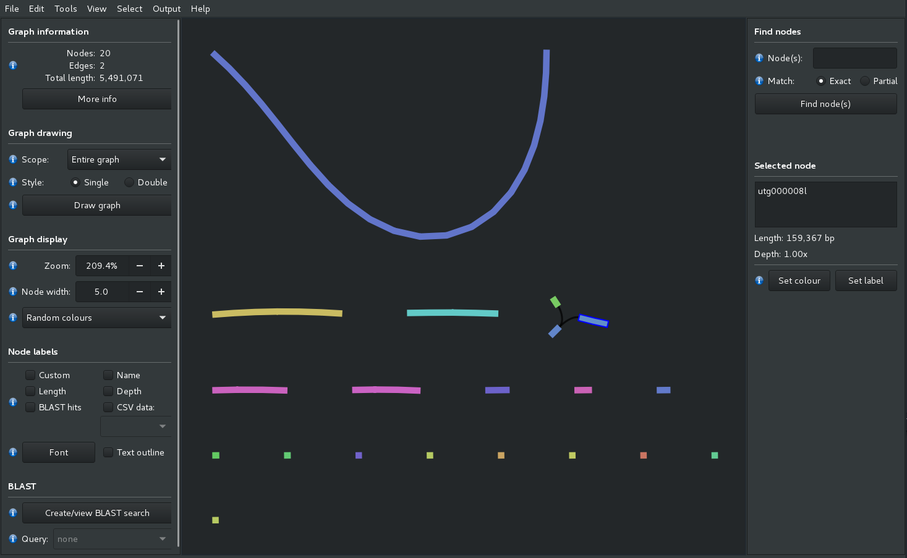

# Assembly of the chrom4 data

**Goals:**

 - assembly of your chrom4 region with either PacBio or Nanopore reads
 - polishing of our assembly in order to decrease residual long read errors

## Initial setup

Before we start with the assembly process we have to provide some kind of structure to our data.

Navigate to `scratch/cluster/monthly/` and generate a folder with the name of your userID

   mkdir user1

Navigate into that new directory

   cd user1

Copy the long reads for your group into that folder from `/scratch/beegfs/monthly/eschmid/workshop_assembly/ATH/PACBIO` or `/scratch/beegfs/monthly/eschmid/workshop_assembly/ATH/ONT`

e.g. for ONT fragment 1

    cp /scratch/beegfs/monthly/eschmid/workshop_assembly/ATH/ONT/ONT_chrom4_S1.reads.fasta .

or PacBio fragment 3

    cp /scratch/beegfs/monthly/eschmid/workshop_assembly/ATH/PACBIO/PB_chrom4_S3.reads.fasta .

Next you need as well all the scripts

    cp -R /scratch/beegfs/monthly/eschmid/workshop_assembly/ATH/software .

In the next steps we will describe the assembly for both, ONT and PacBio.
Please be aware that the variable `$i` represents the fragment on which you are working.
You can either

 - for each command replace ${i} by the number of the fragment in your groups
 - define globally i to your number e.g. `i=3` in bash

## Assess your reads

We will first assess the reads which we have in order to get a feeling for

 - total bp sum
 - theoretical coverage
 - N50 read length

 --->>> add something here!

## PacBio & miniasm

Overlapping:

    bsub -q lr_course -n 5 -R "span[hosts=1]" "module add UHTS/Analysis/minimap2/2.8; \
          minimap2 -x ava-pb -t 5 PB_chrom4_S${i}.reads.fasta PB_chrom4_S${i}.reads.fasta > PB_chrom4_S${i}.overlap.paf"

Assembly:

      bsub -q lr_course "module add UHTS/Analysis/miniasm/0.2.r159.dirty; \
      miniasm -f PB_chrom4_S${i}.reads.fasta PB_chrom4_S${i}.overlap.paf -R  > PB_chrom4_S${i}.miniasm.gfa"

The `gfa` format is very useful as it keeps the assembly path and how elements are connected.
Unfortunately most down-stream tools dont accept it yet and we need to convert the `.gfa` -format to `.fasta`-format:

The next script are very lightweight and can quickly be executed without bsub

      awk '/^S/{print ">"$2"\n"$3}' PB_chrom4_S${i}.miniasm.gfa | fold > PB_chrom4_S${i}.miniasm.fasta

      software/assesV4.2.pl -t 1 -s 1 -i PB_chrom4_S${i}.miniasm.fasta -l -p > PB_chrom4_S${i}.miniasm.assess.txt;

## Nanopore & Miniasm

Overlapping:

    bsub -q lr_course -n 5 -R "span[hosts=1]" "module add UHTS/Analysis/minimap2/2.8; \
      minimap2 -x ava-ont -t 5 ONT_chrom4_S${i}.reads.fasta ONT_chrom4_S${i}.reads.fasta > ONT_chrom4_S${i}.overlap.paf "

Assembly:

    bsub -q lr_course "module add UHTS/Analysis/miniasm/0.2.r159.dirty; \
      miniasm -f ONT_chrom4_S${i}.reads.fasta ONT_chrom4_S${i}.overlap.paf -R > ONT_chrom4_S${i}.miniasm.gfa"

Conversion

      awk '/^S/{print ">"$2"\n"$3}' ONT_chrom4_S${i}.miniasm.gfa | fold > ONT_chrom4_S${i}.miniasm.fasta

      software/assesV4.2.pl -t 1 -s 1 -i ONT_chrom4_S${i}.miniasm.fasta -l -p > ONT_chrom4_S${i}.miniasm.assess.txt;

Now importantly, these assembled sequences still have the average PacBio error rate (>12%).
In order to make it more useable we have to polish.
This can be done with the same Nanopore reads (nanopolish, racon) or Illumina reads (Pillon,Racon).
In general, polishing takes a lot of time - often more time than the assembly itself (especially with miniasm).

### PacBio & Canu

[Wikipage from Canu](http://canu.readthedocs.io/en/latest/tutorial.html)

For this we execute only 1 assembly/group instead each one individually.
Do this please in a "screen" by typing `screen`
The command for the assembly:

    module add UHTS/Assembler/canu/1.6;
    canu  -pacbio-raw PB_chrom4_S${i}.reads.fasta  -d CanuPB${i} -p PB${i} genomeSize=5m &

This will generate a new directory CanuPB(fragment) and do everything in there.
If you executed the command you can leave again the screen with the combination `Ctrl+a+d` and return later to it again with `screen -r `.

### ONT & Canu

Instruction in detail see above

    module add UHTS/Assembler/canu/1.6;
    canu  -nanopore-raw ONT_chrom4_S${i}.reads.fasta  -d CanuONT${i} -p ONT${i} genomeSize=5m

# Visualization of the assembly graph

Both Canu and miniasm generate genome assembly graphs in `.gfa` format which you can visualize e.g. with [Bandage](https://github.com/rrwick/Bandage).
A wiki can be found [here](https://github.com/rrwick/Bandage/wiki).
You can find `.zip` containers of binaries for Mac,Linux and Windows in the `software` folder in your working directory.
You can try to download these locally on your computer and execute them.
**Warning**: there are a few dependencies which are described in `.txt` files within these containers.
If it does not work, dont worry we will visualize a few ones together.

Example of Miniasm PacBio fragment 1:

# Polishing of the assemblies

Now we still have a rather high error rate of > 12% with miniasm which we need to correct for.
This rate is much lower with canu ( less than 1%?) but it still benefits from polishing.

We will primarily use Racon for polishing to keep the work-flow similar between the PacBio and Nanopore analysis.
In general, the tool quiver from PacBio is much more efficient in cleaning residual errors as well as nanopolish for ONT.

For all polishing tools, we 1st have to map reads onto the assembly which is then used to generate consensus sequences.

## Racon

For Racon we can use minimap2 again in order to map the reads which is great as it is extremly fast.

### PacBio Racon

    bsub -q lr_course -n 10 -R "span[hosts=1]" "module add UHTS/Analysis/minimap2/2.8; \
    minimap2 -t 10 -ax map-pb PB_chrom4_S${i}.miniasm.fasta PB_chrom4_S${i}.reads.fasta > PB_chrom4_S${i}.miniasm.remap.sam"

Here we need to specify a set of nodes as the software needs the chipset features "SSEv4_1 SSEv4_2 AVX" in order to function correctly. Otherwise we get core dumps.

    bsub -q lr_course -n 5 -R "span[hosts=1]" -m "cpt129 cpt131 cpt132 cpt133 cpt171 cpt172 cpt181 cpt182 cpt183 cpt184 cpt185 cpt186" " module add UHTS/Assembler/racon/1.0.1; racon PB_chrom4_S${i}.reads.fasta PB_chrom4_S${i}.miniasm.remap.sam PB_chrom4_S${i}.miniasm.fasta -t 5 > PB_chrom4_S${i}.miniasm.racon.fasta"

### ONT racon

    bsub -q lr_course -n 10 -R "span[hosts=1]" "module add UHTS/Analysis/minimap2/2.8; \
    minimap2 -t 10 -ax map-ont ONT_chrom4_S${i}.miniasm.fasta ONT_chrom4_S${i}.reads.fasta > ONT_chrom4_S${i}.miniasm.remap.sam"

    bsub -q lr_course -n 5 -R "span[hosts=1]"  -m "cpt129 cpt131 cpt132 cpt133 cpt171 cpt172 cpt181 cpt182 cpt183 cpt184 cpt185 cpt186" " module add UHTS/Assembler/racon/1.0.1; racon ONT_chrom4_S${i}.reads.fasta ONT_chrom4_S${i}.miniasm.remap.sam ONT_chrom4_S${i}.miniasm.fasta -t 5 > ONT_chrom4_S${i}.miniasm.racon.fasta"

## technology specific Polishing

### PacBio quiver

1st we have to map again the `BAM` files onto the assembly. This does **not** work with the extracted `FASTA` files.
And it only works with the PacBio in-house tool `blasr` which is more sensitive than `minimap2` but slower.
The below used `pbalign` is essentially a wrapper from PacBio which maps and indexes the alignments.

    bsub -q lr_course -n 8 -R "span[hosts=1]" "/scratch/beegfs/monthly/eschmid/smrtlink/smrtcmds/bin/pbalign PB_chrom4_S${i}.bam PB_chrom4_S${i}.miniasm.fasta  PB_chrom4_S${i}.miniasm.pbalign.bam"

We need for quiver to index the assemblies with `samtools`

  bsub -q lr_course "module add UHTS/Analysis/samtools/1.4; samtools faidx PB_chrom4_S${i}.miniasm.fasta "

Next we can run the consensus algorithm "arrow" on it:

    bsub -q lr_course -n 8 -R "span[hosts=1]"  "/scratch/beegfs/monthly/eschmid/smrtlink/smrtcmds/bin/quiver PB_chrom4_S${i}.miniasm.pbalign.bam --referenceFilename PB_chrom4_S${i}.miniasm.fasta -o PB_chrom4_S${i}.miniasm.arrow.fasta --diploid -j 8 --algorithm arrow --fast"

### ONT nanopolish

Unfortunately we dont have the raw data available to do native ONT olishing with `nanopolish`.
If you have any data though, I installed the software on the cluster for the future.
