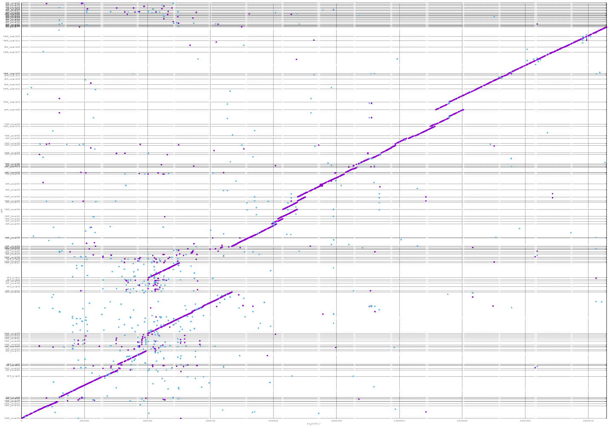
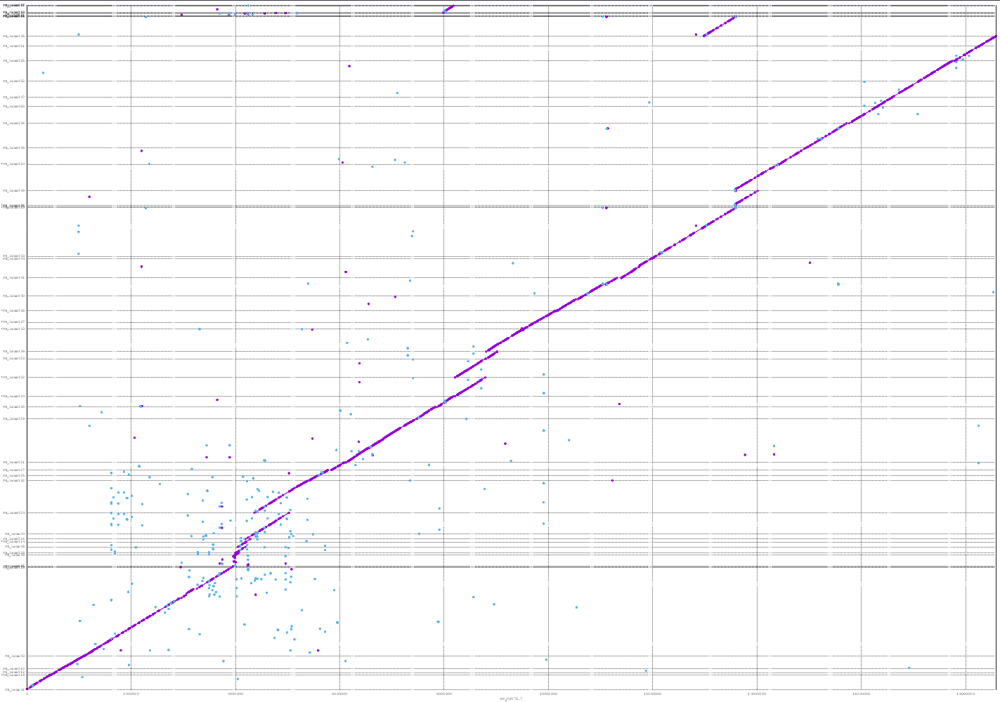

# Post assembly steps

Now each group assembled their pieces and we will combine them.

concatination of the assembled pieces:

    bsub -q lr_course "cat ONT_chrom4_S*.miniasm.racon.fasta > ONT_MINIASM_RACON.assembly.fasta"

The problem now is that we get many sequences which are having the same name - crashing many programs.
Lets fix this:

    bsub -q lr_course "../software/correct_fasta_format.pl -i ONT_MINIASM_RACON.assembly.fasta -r -p ONT > ONT_MINIASM_RACON.assembly.corrected.fasta"

Lets similarly fuse the assembled pieces from Canu

    bsub -q lr_course "cat CanuPB*/PB*.contigs.fasta > CanuAssembledFragments.fasta"

Just to be safe, we rename the headers:

    bsub -q lr_course "../software/correct_fasta_format.pl -i CanuAssembledFragments.fasta -r -p CanuPB  > CanuAssembledFragments.corrected.fasta"


**Important**: from now on, commands will not be explicit anymore but general and you have to adapt them for your need!


## Telomer repeats

An easy first thing to check is whether any telomeric regions have been assembled.
We would obviously only expect them in group 1 and 4 but lets check nevertheless as centromeric repeats can often be very similar.
The telomeric repeat in ATH is TTTAGGG and should appear at the end or beginning of a contig.

Open your assembly file with `less` and search for such a repeat by pressing first `/` and then entering the sequence (1x or multiple times).

## Gene Prediction

Importantly, Augustus needs a model in order to predict correctly genes in an organism.
Even then, the number of 100% correctly predicted genes will likely never exceed 50-60% currently.

If one does not have a model one has to provide external data and build one (verify as well). This is a long and tedious process.

    bsub -q lr_course "module add SequenceAnalysis/GenePrediction/augustus/3.2.3; \
    augustus --species=arabidopsis MyAssembly.fasta --genemodel=complete --gff3=on  > MyAssembly.Augustus.gff"

Here we only predict complete genes and not fragmented ones, to get a better feeling how many are not predicted due to incomplete assembled genes.
I did a similar prediction on the chromosome4 from TAIR, which will allow us to compare the number of predicted genes with a reference.

We get 4341 predicted genes and proteins for the reference chromosome 4.

## BUSCO

Here at the example of the entire CHR4 as present in TAIR10, so that we can later compare our results to what we expect to find from the reference.

      module add UHTS/Analysis/busco/3.0.2;

This will automatically load the package [Augustus](http://bioinf.uni-greifswald.de/augustus/) for gene prediction
Unfortunately it needs though the permission to write in the config folder of Augustus where species specific models are kept.
Therefore, you can find as well an Augustus installation in the local `software` folder.
So, we need to make BUSCO aware of this updated config directory:


    bsub -q lr_course -n 5 -R "span[hosts=1]" "module add UHTS/Analysis/busco/3.0.2; \
     export AUGUSTUS_CONFIG_PATH=$PWD/software/augustus-3.2.3/config/; \
     python /software/UHTS/Analysis/busco/3.0.2/scripts/run_BUSCO.py -i MyAssembly.fasta -o MyPrefix -l software/embryophyta_odb9 -m geno -c 5 -sp arabidopsis"

This should give us a result similar to the one below which was on the chromosome 4 reference:

     INFO    Results:
     INFO    C:17.9%[S:17.8%,D:0.1%],F:0.1%,M:82.0%,n:1440
     INFO    258 Complete BUSCOs (C)
     INFO    257 Complete and single-copy BUSCOs (S)
     INFO    1 Complete and duplicated BUSCOs (D)
     INFO    1 Fragmented BUSCOs (F)
     INFO    1181 Missing BUSCOs (M)
     INFO    1440 Total BUSCO groups searched

Obviously it is not surprising to find many missing as we have only 1 chromosome analyzed.

## Remapping of raw reads

As already done for the polishing step, one can map back the original reads to the assembled pieces and then visualize the
coverage. Ideally this should be rather uniform over the contig often with a decreasing slope towards the edges.

   bsub  -q lr_course    'module add UHTS/Analysis/BEDTools/2.26.0;\
   bedtools genomecov -ibam My.bam -bga -g MyAssembly.fasta > MyMapping.bedGraph '

In this case the option `bga` specifies that as well uncovered regions will be analyzed, resulting in a `0` coverage in these regions.
These graphs are best visualized with a genome viewer, e.g. IGV.
[You can find IGV here](http://software.broadinstitute.org/software/igv/download) for different OS installation-free.

If we have enough time, download it, install it and load your genome alongside with the bedGraph file to visualize the coverage.


## Mummer


    bsub -q lr_course  -n 10 -R "span[hosts=1]" "  module add UHTS/Analysis/mummer/4.0.0beta1; nucmer ../chrom4.fasta MyAssembly.fasta -p MyPrefix "

    bsub -q lr_course "module add UHTS/Analysis/mummer/4.0.0beta1; mummerplot --layout --large  --postscript MyPrefix.delta -p MyPrefix"

**Important**: due to an unsolved bug with gnuplot this command does **not** succeed. It generates though the intermediate file which we can plot.

    bsub "gnuplot MyPrefix.gp"


Here an example with Canu - first all fragments assembled independently with ONT



and similarly with PACBIO




another nice way to visualize this, Dot [link](https://github.com/dnanexus/dot):

    python3 ../software/DotPrep.py --delta MyPrefix.delta


It further contains another piece of the mummer suite `dnadiff` which summarizes the above in quantitative numbers:

    bsub "module add UHTS/Analysis/mummer/4.0.0beta1; dnadiff -d MyPrefix.delta -p MyPrefix"

Which generates a report similar to the below one (again similar example as above for combined Canu assembled fragments):

ONT:


```bash
                                [REF]                [QRY]
[Sequences]
TotalSeqs                          1                  117
AlignedSeqs               1(100.00%)          107(91.45%)
UnalignedSeqs               0(0.00%)            10(8.55%)

[Bases]
TotalBases                  18585056             25685781
AlignedBases        14979608(80.60%)     16630528(64.75%)
UnalignedBases       3605448(19.40%)      9055253(35.25%)

[Alignments]
1-to-1                          2645                 2645
TotalLength                 15307664             14336197
AvgLength                    5787.40              5420.11
AvgIdentity                    85.90                85.90

M-to-M                          3724                 3724
TotalLength                 17922993             16787839
AvgLength                    4812.83              4508.01
AvgIdentity                    85.76                85.76

[Feature Estimates]
Breakpoints                     7448                 7400
Relocations                      100                  105
Translocations                   454                    0
Inversions                         8                   78

Insertions                      2583                 4420
InsertionSum                 3723845             11229937
InsertionAvg                 1441.67              2540.71

TandemIns                          3                    3
TandemInsSum                     342                  565
TandemInsAvg                  114.00               188.33

```
This tells us now, that we have ~20% of unaligned nucleotides in the reference - which cant be found in the new assembly (in a meaningful match).
On the other hand we do have additional 35% of unaligned bases in the other direction as well.

It further tells us that we have 26Mbp assembled instead of 18.5Mbp which is not surprising considering the fact that we have 3x 1Mbp overhang in the design. The identity in between 1-1 alignments is 86% which is very low. This shows the biggest problem with miniasm - that we have at the end an error rate close to the original one.

and PacBio:

```bash
[REF]                [QRY]
[Sequences]
TotalSeqs                          1                   55
AlignedSeqs               1(100.00%)           49(89.09%)
UnalignedSeqs               0(0.00%)            6(10.91%)

[Bases]
TotalBases                  18585056             22108612
AlignedBases        16642741(89.55%)     19862098(89.84%)
UnalignedBases       1942315(10.45%)      2246514(10.16%)

[Alignments]
1-to-1                          1478                 1478
TotalLength                 16947488             17038145
AvgLength                   11466.50             11527.84
AvgIdentity                    87.95                87.95

M-to-M                          1895                 1895
TotalLength                 19844080             19950206
AvgLength                   10471.81             10527.81
AvgIdentity                    87.93                87.93

[Feature Estimates]
Breakpoints                     3790                 3742
Relocations                       78                   40
Translocations                   128                    0
Inversions                         5                   28

Insertions                      1316                 2112
InsertionSum                 1984113              5102726
InsertionAvg                 1507.68              2416.06

TandemIns                          5                   11
TandemInsSum                     778                 4777
TandemInsAvg                  155.60               434.27
```

Now here we have less additionally assembled material (not surprising as filtering initially was less stringent) and we have as well less missing unaligned bases in both directions (~10%).

But similarly the identity is very low with < 90%.
