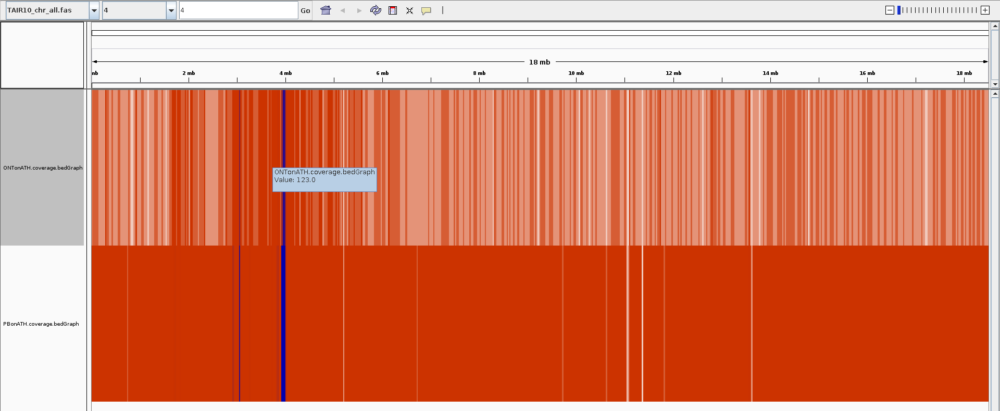

# Pre assembly steps for chrom4

## conversion of reads to FASTA.


### PacBio

PacBio sequencing data come these days in `BAM` format, previously in `h5`.
To extract the subreads one can use multiple tools.
Here we use bamtools but there are other options (e.g. DEXTRACTOR)

     bsub 'module add UHTS/Analysis/bamtools/2.4.1; \
     bamtools convert -in ../RAW/pb.bam -out SUBREADS/pb.fasta -format fasta'

### ONT

For ONT we only have to convert here the data to `FASTA` for some of the steps.
As we have multiple `''` and `""` signs in the command it is easier to write a quick bsub script rather to submit a command directly.

```bash
cat fastq2fasta.sh

#!/bin/bash
zcat ../RAW/ont.fq.gz | awk  '{if(NR%4==1) {printf(">%s\n",substr($0,2));} else if(NR%4==2) print;}' > SUBREADS/ont.fasta
```

This can then be submitted

    bsub < fastq2fasta.sh


## mapping reads onto chromosome 4


Next, we map all reads against the chromosome 4 in order to find reads of interest

### PacBio

     bsub -q lr_course -n 5 -R "span[hosts=1]" \
     'module add UHTS/Analysis/minimap2/2.8; \
      module add UHTS/Analysis/samtools/1.4;  \
      minimap2 ../TAIR10_chr_all.fas SUBREADS/pb.fasta -x map-pb -a -t 20 | samtools view -bhS | samtools sort -o PBonATH.bam'

Which has to be indexed as well

    bsub 'module add UHTS/Analysis/samtools/1.4; samtools index PBonATH.bam '

### ONT


    bsub -n 5 -R "span[hosts=1]" -q lr_course \
    'module add UHTS/Analysis/minimap2/2.8; \
    module add UHTS/Analysis/samtools/1.4;\
    minimap2 ../TAIR10_chr_all.fas SUBREADS/ont.fasta -x map-ont -a -t 20 | samtools view -bhS | samtools sort -o ONTonATH.bam &&  samtools index ONTonATH.bam'

Important: the `-x map-ont` or pb specifies which data-type we are providing.


# update below!

We can visualize now the coverage in order to get an idea whether we have gaps or repeats for each data set.

      bsub  -q lr_course   'module add UHTS/Analysis/BEDTools/2.26.0; \
        bedtools genomecov -ibam PBonATH.bam -bga -g ../chrom4.fasta > PBonATH.cvoreage.bedGraph'


      bsub   -q lr_course  'module add UHTS/Analysis/BEDTools/2.26.0;\
      bedtools genomecov -ibam ONTonATH.bam -bga -g ../chrom4.fasta > ONTonATH.coverage.bedGraph '



This is in a heatmap style (30-100x in orange, above in intesifying blue, capped at 2000x coverage).

There is a big repeat at around 4 Mbp (maybe centromeric region).
Interestingly, there are a few white regions in the heatmap indicating that there might be differences between the 2 genotypes possible.

Lets now split the chromosome into 4 to build later 4 groups in the course:

0-5 Mbp
4-9 Mbp
8-14 Mbp
13-End Mbp

As we generate 4 overlapping regions we hopefully can later stich them together again.

Now we want all the read names which are associated with reads matching to each region:

## filter reads which are suitable

We will use the alignment file here and extract all reads which have a Sam flag "0".

### PacBio


```bash
cat  extractRegionsPB.sh

#!/bin/bash
#BSUB -e PBsplitting.error.txt
#BSUB -e PBsplitting.infor.txt
#BUSB -q lr_course
module add UHTS/Analysis/samtools/1.4;
samtools view PBonATH.bam "4:1-5000000"         | awk '{if(/^m54052/ && $2==0) print $1}' > PB_chrom4_S1.reads &
samtools view PBonATH.bam "4:4000000-9000000"   | awk '{if(/^m54052/ && $2==0) print $1}' > PB_chrom4_S2.reads &
samtools view PBonATH.bam "4:8000000-14000000"  | awk '{if(/^m54052/ && $2==0) print $1}' > PB_chrom4_S3.reads &
samtools view PBonATH.bam "4:13000000-18585056" | awk '{if(/^m54052/ && $2==0) print $1}' > PB_chrom4_S4.reads &
```

In order to later polish with PacBio we need a BAM file as input. We therefore need to 1st subset the raw BAM file based on the above information.
We made a little tools which takes the ZMV and extracts the entries:

    for i in {1..4};
    do
      bsub -q lr_course "perl -npe 's/.*\/([0-9]+)\/.*/\$1/' PB_chrom4_S${i}.reads | sort -n | uniq > PB_chrom4_S${i}.zmv" &
    done

    for i in {1..4};
    do
      bsub -q lr_course "/scratch/beegfs/monthly/eschmid/workshop_assembly/ATH/software/Filter/bin/FilterBAM ../RAW/pb.bam PB_chrom4_S${i}.bam PB_chrom4_S${i}.zmv &"
    done

Note: this subsettings is almost never necessary as one would normally assemble the entire genome. We therefore wrote a quick script on the fly. There might ne as well the possibility to use samtools/bamtools to subset these alternatively but we did not try.

### ONT

Again, this is in principle similar than above except that we dont need to subset a `BAM` file but (which is easier) a `FASTA` file.


```bash
cat  extractRegionsONT.sh


#!/bin/bash
#BSUB -e PBsplitting.error.txt
#BSUB -e PBsplitting.infor.txt
#BUSB -q lr_course

module add UHTS/Analysis/samtools/1.4;
samtools view ONTonATH.bam "4:1-5000000"         | awk '{if(/Basecall/ ) print $1}' > ONT_chrom4_S1.reads &
samtools view ONTonATH.bam "4:4000000-9000000"   | awk '{if(/Basecall/ ) print $1}' > ONT_chrom4_S2.reads &
samtools view ONTonATH.bam "4:8000000-14000000"  | awk '{if(/Basecall/ ) print $1}' > ONT_chrom4_S3.reads &
samtools view ONTonATH.bam "4:13000000-18585056" | awk '{if(/Basecall/ ) print $1}' > ONT_chrom4_S4.reads &
```
There is a small but important difference here. Previously we took only reads with the SAM flag "0" which would be unambigious matches. Here we take everything as we have much less data than with the PacBio.


## extract the subreads as FASTA for Miniasm (or Canu)


### pacbio

This is similar to the above where we extract all reads from the `BAM` file

    for i in {1..4};
    do
    bsub -q lr_course 'module add UHTS/Analysis/bamtools/2.4.1; \
      bamtools convert -in PB_chrom4_S${i}.bam -out PB_chrom4_S${i}.reads.fasta -format fasta' &
    done


### ONT

Now we want to extract the reads in FASTA for the assembly. There are many ways to do that and I recommend you writing your own script in your prefered language. Ways to do that:

 - samtools faidx
 - BEDTools
 - blastcmd
 - ....


I used my own script (available but with no guarantee !)

for i in {1..4};
do
     bsub "software/extract_scaffold_version4.pl  -i ONT_chrom4_S${i}.reads -f ont.fasta -s > ONT_chrom4_S${i}.reads.fasta " &
done
